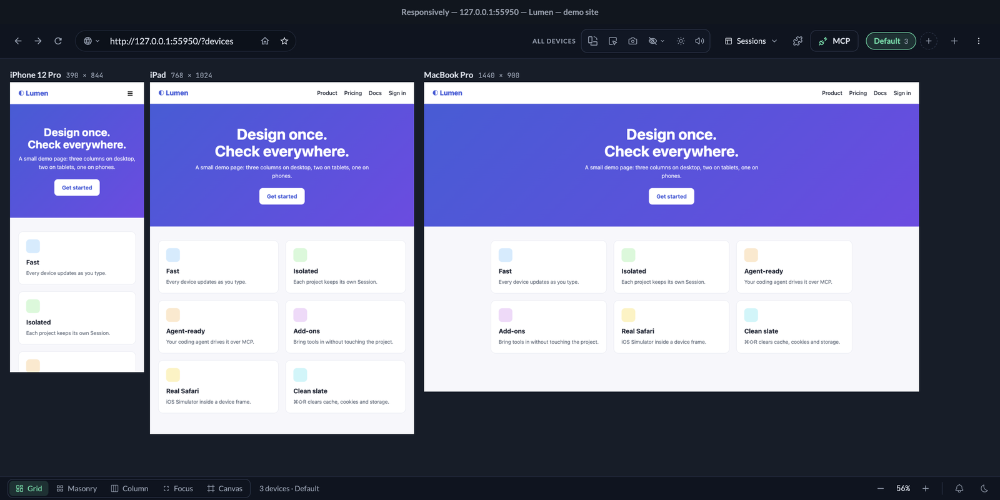
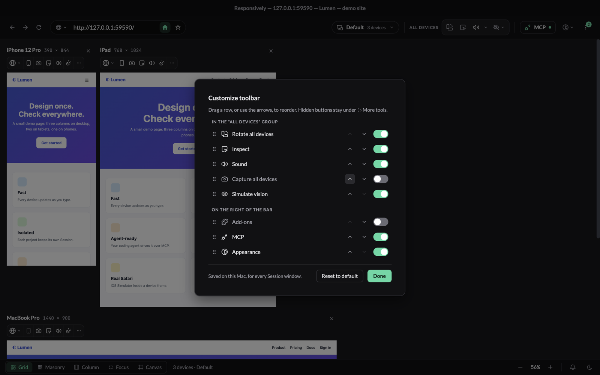
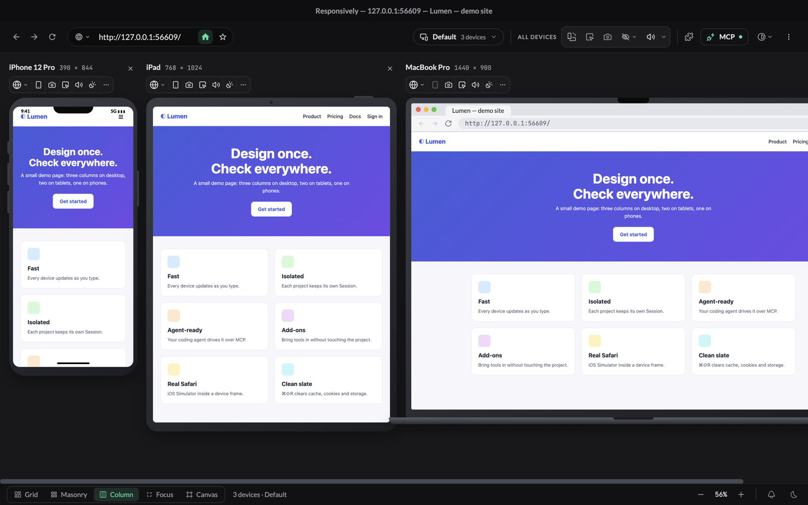
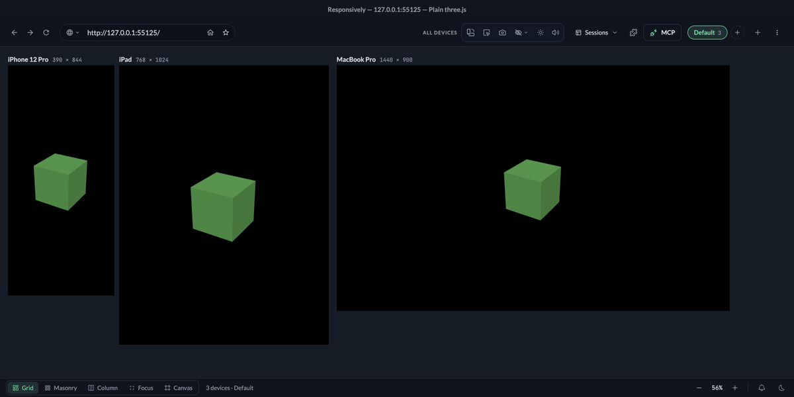
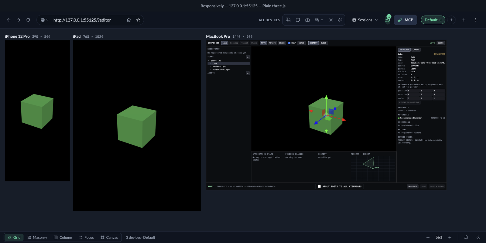
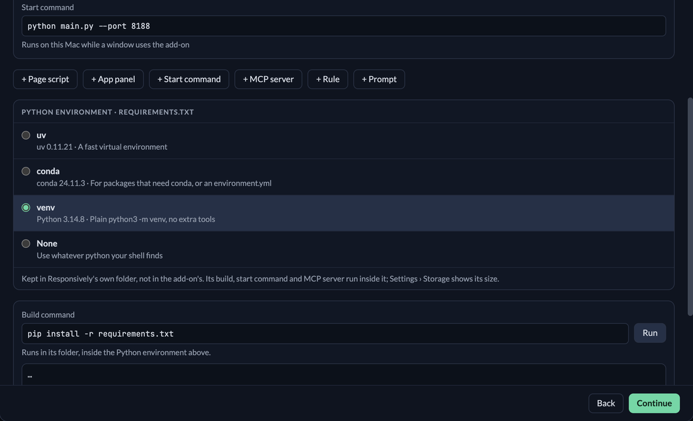
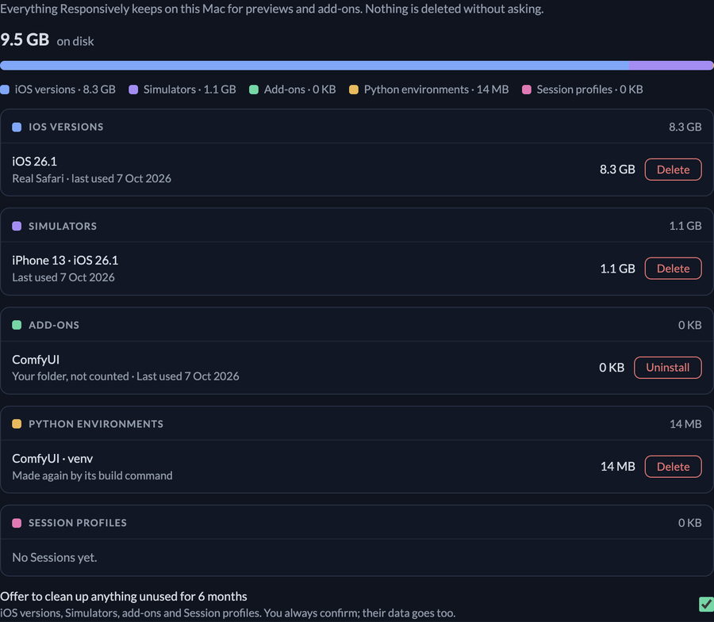
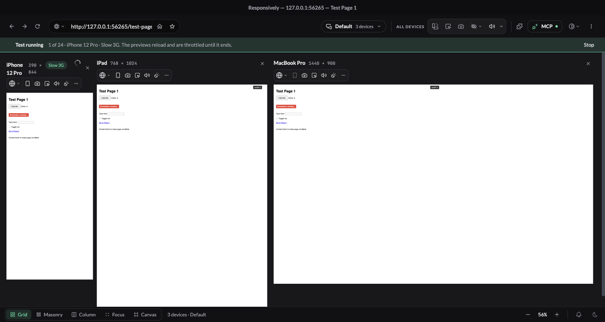

# Responsively Sessions

A maintained fork of [responsively-org/responsively-app](https://github.com/responsively-org/responsively-app) focused on **persistent, isolated browser Sessions** and reliable **MCP-driven development workflows**.

This is not an official Responsively release. The original Responsively project, website and general-purpose downloads remain upstream.



_One page, every device at once: the phone gets one column and a menu button, the iPad two columns, the MacBook three. Your coding agent drives the same window over MCP._

## Why this fork exists

The upstream app is designed as one responsive-development browser. This fork adds a project/session layer so one installed app can safely serve several independent projects without sharing browser state or taking over each other's MCP runtime.

Each Session has its own:

- persistent browser profile and storage;
- process;
- MCP and BrowserSync runtime ports;
- device choices and browsing state;
- stable UUID and human-readable name.

A single controller owns the Session registry and lifecycle. Session identity never depends on a PID or temporary port.

## What is different from upstream

| Area                      | Upstream Responsively        | This fork                                                                             |
| ------------------------- | ---------------------------- | ------------------------------------------------------------------------------------- |
| Project isolation         | One app/browser context      | Named persistent Sessions with separate profiles/processes                            |
| Session lifecycle         | Not applicable               | Create, Open, Focus, Stop, Rename, Reset and Delete                                   |
| Launcher                  | Normal app launch            | Native macOS menu-bar/Dock Session launcher                                           |
| Restore                   | App-level state              | Reopens only Sessions that were active at the last clean Quit                         |
| MCP lifecycle             | Browser tools                | Adds Session lifecycle tools alongside browser tools                                  |
| Destructive agent actions | Not applicable               | MCP cannot Reset or Delete Sessions                                                   |
| Local build               | Standard app identity        | Isolated `ResponsivelyMCP.app` with its own bundle ID, ports and data                 |
| Runtime baseline          | Upstream moves independently | Intentionally frozen on Electron **43.1.1** until a concrete need justifies migration |

The current known-good application-code baseline is:

```text
1bc0caafc554eba240d69f0ccf513a7c2b3da357
```

That commit (milestones M1, M2, M5 and M6 plus their fixes, and PRs #20–#28: `create_session` hidden from agents, the stuck devtools panel, per-Session mute, Cmd-Tab/Dock bringing back the last Session, Cmd+R / Cmd+Shift+R, agents on/off per Session, Session tabs (Ctrl+Tab, Cmd+T / Cmd+N, ⌘1–9, ⌘W hands the spot to the next tab), the Session-name tools menu, the MCP panel's per-agent allow list and hard reset, and the sliding toolbar; see [the roadmap](desktop-app/SESSIONS_ROADMAP.md)) has been merged, validated as a packaged test app (Gate C, 24/24), installed and smoke-tested on macOS. The tip of `main` can be newer because of documentation-only commits; those don't change the application. Later milestones become the baseline only after they are merged, installed and smoke-tested the same way. Upstream dependency/toolchain changes, including Electron 44, are **not automatically merged**. Useful upstream fixes are evaluated individually.

## Current product model

The intended model is one normal Mac app with multiple project Sessions:

1. Launch Responsively.
2. Previously active Sessions restore after a clean Quit.
3. Use the menu-bar icon or Dock menu to open/focus Sessions.
4. Use **Manage Sessions** to create, rename, stop, reset or delete them.
5. Close a Session window (⌘W or the red button) to stop that Session; its data is kept.
6. Press ⌘Q twice in any Session window to quit the whole app; Sessions that were open reopen at the next launch.
7. New Session windows open on the monitor you are working on.
8. Agents may create/open/focus/stop Sessions through MCP, but they cannot Reset or Delete them.

Reset is intentionally stopped-only and moves the Session profile to the OS Trash while keeping the Session definition, name and starting URL. Delete also uses the Trash rather than silently destroying profile data.

See:

- [Sessions architecture and lifecycle](desktop-app/SESSIONS.md)
- [Sessions roadmap, verified issues and planned milestones](desktop-app/SESSIONS_ROADMAP.md)
- [Sessions execution and validation process](desktop-app/SESSIONS_PROCESS.md)

## Toolbar and devices


- **Devices ▾** picks the suite and which devices are in it.
- **All devices** acts on every preview: rotate, inspect, capture, simulate vision and sound. The speaker mutes everything in one click; **▾** beside it mutes, shows what is playing and sets the volume per device.
- **Appearance** sets Responsively's own Dark/Light and colour, and Light/Dark for every preview's page (`prefers-color-scheme`).
- Each device header has its own **rotate, screenshot, inspect, sound and light/dark**; **⋯** holds refresh, devtools, rulers, focus, full-page screenshot, design overlay and event mirroring; **×** takes the device out of the suite.
- **⋮ › Manage Sessions…** (⌘⇧M) opens the Sessions manager.
- **⋮ › Customize toolbar…** shows, hides and reorders the toolbar's buttons (drag a row, or use its arrows). A hidden button isn't gone: it's listed under **⋮ › More tools**, where one click runs it or opens its usual menu, and ⋮ shows how many are hidden. The layout is saved on this Mac for every Session window; **Reset to default** brings everything back.





**Appearance › Device frames** (off by default) draws hardware around every preview in any layout: a notch, buttons, status bar and home bar on phones, a camera and button on iPads, a camera and base on laptops. **Browser bar on laptops** adds a browser's chrome above the laptop preview, live: the page's title and address, with back, forward, reload and stop for that device. Both sit outside the page, so every preview keeps its exact device size, and screenshots, rulers and the design overlay are unchanged. Both settings are remembered.

## Add-ons

Dev tools live in Responsively instead of in your project's packages. Paste a GitHub repo, an npm package, a web address (say, a ComfyUI panel) or a folder; it is used as it is, nothing to convert. Responsively shows what it found (page scripts, an app panel, an MCP server, rules written like Claude skills, premade prompts) and lets you run its build in a small terminal. Before it installs, it asks for exactly what the add-on may do. Every part has its own switch, and you can save a set of switches as a stack.



_Installing [compose3d](https://github.com/FilippoRomeo/compose3d) from its repo. Then a plain three.js page (no compose3d in its packages) gets the editor, and you can select and move its objects:_



Agents get the same things through MCP: the add-on's tools (`list_addon_tools`, `call_addon_tool`), its rules (`get_rules`) and prompts (`get_prompts`), and `evaluate` to read and change the live page, here the three.js scene.

### Python tools

A Python project (a `requirements.txt`, `pyproject.toml` or `environment.yml`) gets its own environment: uv, conda or a plain venv, whichever this Mac has, or none. The environment lives in Responsively's folder, never in the project's, and the add-on's build, start command and MCP server all run inside it.



## Storage

**Settings › Storage** shows everything Responsively keeps on this Mac in one place: iOS versions, Simulators, add-ons, their Python environments and each Session's profile (cache, cookies, storage). Each item shows its size and when it was last used, and is removed with two clicks: Delete, Uninstall, or Reset for a Session profile, which goes to the Trash. Anything unused for six months is marked, and one button offers to clean it all up; you always confirm.



## Test under real conditions

Ask an agent (or use the MCP tools) to measure a page the way people meet it: slow networks, a slower CPU, light or dark. `run_test` loads each page on each Chromium device under every combination (up to 60, one at a time, cache off) and writes a report: load time, LCP, layout shift, requests, bytes, failed requests, console errors, script time, memory, horizontal overflow and a screenshot per measurement. Networks: Wi-Fi, 5G, 4G, Fast 3G, Slow 3G, Offline; CPU 1× to 20× slower.



- While it runs, the previews reload and are throttled on purpose; **Stop** ends it. Afterwards every preview is put back exactly: no throttling, its own colour scheme, the page it showed.
- `set_conditions` / `clear_conditions` apply the same conditions by hand; a chip on the device header shows them, and clicking it clears them.
- Reports are kept per Session (the latest 20) and listed in **Settings › Storage › Test reports** with a Delete button. Agents read them with `list_reports` and `get_report`. Real iOS Safari previews are listed as not measured.

## Supported build

The validated local build currently targets:

- macOS;
- Apple Silicon (`arm64`);
- Node.js `>=24.x`;
- Electron `43.1.1`;
- app version `2.0.0-beta.0`;
- bundle ID `app.responsively.mcp.local`.

The installed app lives at:

```text
~/Applications/ResponsivelyMCP.app
```

Its data is intentionally separate from the normal Responsively release:

```text
~/Library/Application Support/ResponsivelyMCP
~/Library/Application Support/ResponsivelySessions
```

## Install this fork on macOS Apple Silicon

### 1. Clone the fork

```bash
git clone https://github.com/FilippoRomeo/responsively-app.git
cd responsively-app
git checkout main
```

For a reproducible install, confirm the expected baseline before building:

```bash
git diff --quiet 1bc0caafc554eba240d69f0ccf513a7c2b3da357 HEAD -- \
  desktop-app \
  ':(exclude,glob)desktop-app/**/*.md' \
  ':(exclude)desktop-app/scripts/gates' \
  && echo "desktop app non-doc files match the validated baseline"
```

This compares every non-Markdown file under `desktop-app` (source, assets, build config, lockfiles, tests) with the validated baseline `1bc0caafc554eba240d69f0ccf513a7c2b3da357`, so documentation-only commits on `main` don't cause a mismatch. The validation scripts in `desktop-app/scripts/gates/` are excluded too: they build and test the app but aren't part of it. If it prints nothing, something that can affect the app differs from what was validated.

### 2. Install dependencies

```bash
cd desktop-app
npx -y yarn@1.22.22 install --frozen-lockfile
```

### 3. Build and install the isolated app

```bash
npx -y yarn@1.22.22 package:mcp-local
```

The packaging script:

- requires macOS `arm64`;
- builds the app;
- packages it with bundle ID `app.responsively.mcp.local`;
- ad-hoc signs and verifies the bundle;
- installs it as `~/Applications/ResponsivelyMCP.app`.

**Important:** use this script for a **first install** only. If `~/Applications/ResponsivelyMCP.app` already exists with the expected bundle ID, the script deletes and replaces that app bundle without a backup. It does not remove the Application Support data directories, but to **update a working installation**, use the backup-first steps below.

### Update an existing install (backup first)

The commit must be pushed to this fork. Quit Responsively from its menu-bar icon first, and run each step in a normal Terminal window from the repository root:

```bash
git checkout main && git pull --ff-only
SHA="$(git rev-parse HEAD)"
# Run folders are never reused: to retry a step, give it a new name (-002, -003, ...).
GATEC_RUN="c-${SHA:0:7}-001"
INSTALL_RUN="install-${SHA:0:7}-001"

# 1. Test a separate copy of that exact commit (~20 minutes; it asks you 3 yes/no questions).
bash desktop-app/scripts/gates/gatec.sh "$SHA" "$GATEC_RUN"

# 2. Build the same commit with the installed app's identity (safe while the app runs).
bash desktop-app/scripts/gates/gatef.sh prepare "$GATEC_RUN" "$INSTALL_RUN"

# 3. Quit Responsively, then back up the app and both data folders (verified by SHA-256).
bash desktop-app/scripts/gates/gatef.sh backup "$INSTALL_RUN"

# 4. Swap the app in; the old one is kept in the backup and a rollback command is printed.
bash desktop-app/scripts/gates/gatef.sh replace "$INSTALL_RUN"
```

Each step stops at the first failure and never deletes anything. `prepare` refuses a commit whose Gate C run didn't pass, and `replace` installs only a bridge byte-identical to the one Gate C tested. Test runs live in `~/ResponsivelyGateC/<run>/` and installs, with their backups, in `~/ResponsivelyGateF/<install-run>/`. If the bridge changed, restart Claude Desktop afterwards so it loads the new one. Details: Gates C and F in [SESSIONS_PROCESS.md](desktop-app/SESSIONS_PROCESS.md).

### 4. Launch it

```bash
open "$HOME/Applications/ResponsivelyMCP.app"
```

The isolated build uses these defaults:

| Setting                        | Value                                                |
| ------------------------------ | ---------------------------------------------------- |
| App                            | `~/Applications/ResponsivelyMCP.app`                 |
| Bundle ID                      | `app.responsively.mcp.local`                         |
| MCP port                       | `12721`                                              |
| BrowserSync port               | `12722`                                              |
| App data                       | `~/Library/Application Support/ResponsivelyMCP`      |
| Session data                   | `~/Library/Application Support/ResponsivelySessions` |
| `responsively://` registration | disabled                                             |
| Auto-updater                   | disabled                                             |

## Connect Claude Code

The validated user-scope configuration is:

```bash
claude mcp add responsively -s user \
  -e RESPONSIVELY_APP_PATH="$HOME/Applications/ResponsivelyMCP.app" \
  -e RESPONSIVELY_MCP_PORT=12721 \
  -e RESPONSIVELY_BROWSER_SYNC_PORT=12722 \
  -e RESPONSIVELY_USER_DATA_DIR="$HOME/Library/Application Support/ResponsivelyMCP" \
  -e RESPONSIVELY_DISABLE_PROTOCOL_REGISTRATION=true \
  -e CI=true \
  -- npx -y @responsively/mcp@1.0.0
```

The explicit port and data variables keep the MCP bootstrap attached to this isolated fork instead of the normal Responsively installation.

## Connect Codex

Add this to the relevant Codex configuration:

```toml
[mcp_servers.responsively]
command = "npx"
args = ["-y", "@responsively/mcp@1.0.0"]

[mcp_servers.responsively.env]
RESPONSIVELY_APP_PATH = "/Users/YOU/Applications/ResponsivelyMCP.app"
RESPONSIVELY_MCP_PORT = "12721"
RESPONSIVELY_BROWSER_SYNC_PORT = "12722"
RESPONSIVELY_USER_DATA_DIR = "/Users/YOU/Library/Application Support/ResponsivelyMCP"
RESPONSIVELY_DISABLE_PROTOCOL_REGISTRATION = "true"
CI = "true"
```

Replace `YOU` with your macOS username.

## Connect Claude Desktop

Claude Desktop starts the bootstrap with only the environment in its config file. Without these variables the bootstrap looks for the standard `ResponsivelyApp` install, can't find this fork, and every request fails with "Responsively App is not installed, or an installed version predates the MCP bridge".

Add this to `~/Library/Application Support/Claude/claude_desktop_config.json`, then restart Claude Desktop:

```json
{
  "mcpServers": {
    "responsively": {
      "command": "npx",
      "args": ["-y", "@responsively/mcp@1.0.0"],
      "env": {
        "RESPONSIVELY_APP_PATH": "/Users/YOU/Applications/ResponsivelyMCP.app",
        "RESPONSIVELY_MCP_PORT": "12721",
        "RESPONSIVELY_BROWSER_SYNC_PORT": "12722",
        "RESPONSIVELY_USER_DATA_DIR": "/Users/YOU/Library/Application Support/ResponsivelyMCP",
        "RESPONSIVELY_DISABLE_PROTOCOL_REGISTRATION": "true",
        "CI": "true"
      }
    }
  }
}
```

Replace `YOU` with your macOS username; JSON values are not shell-expanded, so `$HOME` does not work here.

## MCP tools

The fork keeps the normal browser-control tools and adds Session lifecycle operations.

Browser tools include:

- `get_app_state`
- `navigate`
- `list_devices`
- `set_active_devices`
- `screenshot`
- `read_page`
- `click`
- `type_text`
- `set_device_browser` (a phone preview can show real iOS Safari from the iOS Simulator)
- `evaluate` (run JavaScript in a preview and get the result)
- `list_addon_tools`, `call_addon_tool`, `get_rules`, `get_prompts` (see [Add-ons](#add-ons))
- `run_test`, `set_conditions`, `clear_conditions`, `list_reports`, `get_report` (see [Test under real conditions](#test-under-real-conditions))

Each browser tool takes an optional `session` argument, a Session UUID from `list_sessions`. The bridge looks up that Session's current MCP port on every call, so the same UUID keeps working after the Session restarts on a new port:

```text
navigate   {"session": "<UUID>", "url": "http://localhost:3000"}
screenshot {"session": "<UUID>"}
```

A stopped Session is never opened implicitly: the call returns an error naming the Session and telling the agent to call `open_session`. The app also shows you that Session in the menu-bar panel, with why it is unavailable and who stopped it, without taking keyboard focus (at most once per Session every 5 minutes). Without `session`, browser tools use the configured port as before.

Session lifecycle tools include:

- `list_sessions`
- `get_session`
- `open_session`
- `focus_session`
- `stop_session`

Reset and Delete are deliberately **not exposed to MCP**. Agents also cannot create Sessions: they work in the ones you made (`create_session` is hidden unless the bridge runs with `RESPONSIVELY_MCP_ALLOW_CREATE_SESSION=1`, which only the Gate C driver sets).

## Known limitations and roadmap

The stable baseline is intentionally frozen because it is the version proven end-to-end. There are still known UX issues; they are documented instead of being hidden behind continuous refactoring.

Milestone M1 fixed the window and Quit behavior: `⌘W` / the red button now stop the Session, `⌘Q` in a Session window quits the whole app after a second press, new windows open on the current monitor, and the per-Session "What's new" card is gone.

Remaining known issues include:

- each new profile logs harmless migration errors once (upstream has a small fix, not yet cherry-picked).

Milestone M2 gives a Session window one manager (⌘⇧M opens the toolbar manager), shows the Session's name on the toolbar button, and stops unnecessary background polling.

Milestone M6 shows you a Session an agent could not use, with who stopped it (you, closing its window, Quit, an agent or a crash) and Open/Restart, Reset, Delete, and Force quit for a hung process behind a second warning. Every lifecycle action is written as one `[sessions]` line to `~/Library/Logs/ResponsivelyApp/main.log`, and **Manage Sessions…** always opens the list.

The evidence, severity and planned milestones are tracked in [SESSIONS_ROADMAP.md](desktop-app/SESSIONS_ROADMAP.md).

## Development policy

The working rules for this fork are intentionally conservative:

- keep `main` on the proven Electron 43 baseline unless a concrete feature or bug requires otherwise;
- one problem per branch;
- tests before install;
- validate packaged macOS behavior, not only source-level tests;
- destructive profile actions require explicit confirmation and use the Trash;
- upstream changes are candidates, not automatic upgrades.

The branch `refactor/sessions-process-roles` is a validated structural cleanup kept on GitHub as a reference. It is not part of the current stable baseline unless explicitly merged later.

## Upstream Responsively

This work is based on [Responsively App](https://github.com/responsively-org/responsively-app). For the original project's releases, website, browser extension, community and cross-platform packages, use the upstream project:

- Website: https://responsively.app
- Upstream repository: https://github.com/responsively-org/responsively-app
- Upstream releases: https://github.com/responsively-org/responsively-app/releases

For problems specific to Sessions, the isolated MCP build or behavior introduced by this fork, use this fork's GitHub issues.
